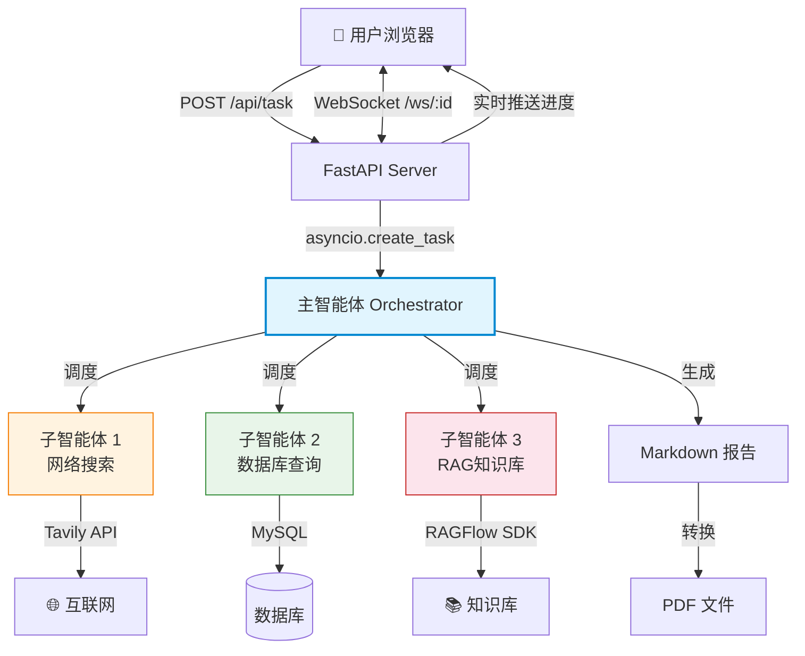
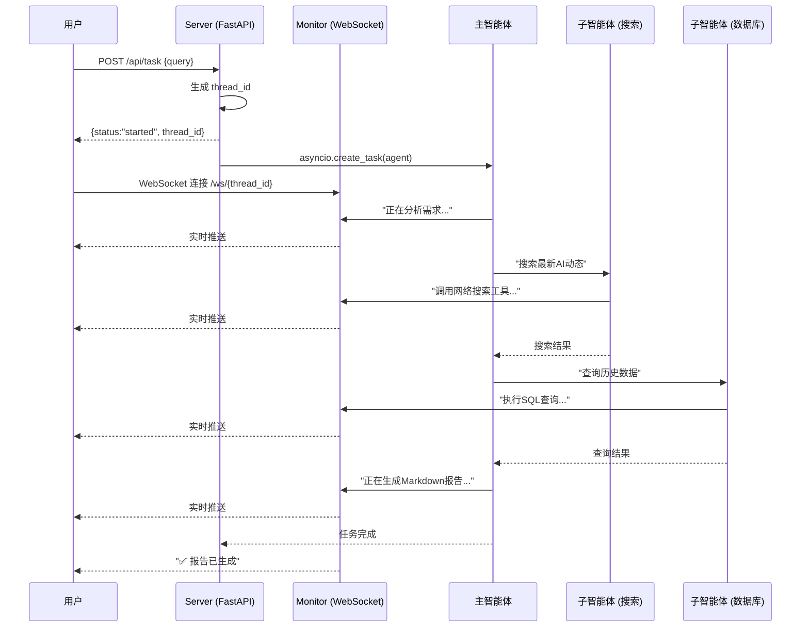

<p align="center">
  <h1 align="center">🤖 MultiAgent-Search</h1>
  <p align="center"><b>轻量级多智能体协作系统 —— AI Agent 开发入门实战项目</b></p>
  <p align="center">
    
    
    
    
    
    
  </p>
</p>

---

## 🎯 这是什么

一个 **不到 1000 行代码** 的 AI Agent 学习项目。用最精简的方式展示如何基于 LangChain 生态构建**多智能体协作系统** — 一个"主智能体"像团队负责人一样调度三个"子智能体"（网络搜索、数据库查询、知识库检索）协同完成复杂任务。

**如果你是这样的人，这项目就是为你准备的 👇**

- 正在学 LangChain / LangGraph，想找一个**完整、能跑**的实战项目
- 对"多智能体编排"感兴趣，但不想一上来就看复杂的 AutoGPT / CrewAI 源码
- 想理解 **FastAPI + WebSocket + Agent** 怎么组合成一个真实可用的系统
- 面试前需要一个 AI Agent 项目充实简历，并且能讲清楚每个设计决策

---

## 🏗️ 架构

### 整体架构图



### 请求流程图



### 数据流

1. 用户 `POST /api/task` 发自然语言请求
2. 主智能体分析需求，决定调用哪些子智能体
3. 子智能体各司其职 — 搜网络 / 查数据库 / 翻知识库
4. 主智能体汇总信息，生成 Markdown 报告（可转 PDF）
5. 全过程经 WebSocket 实时推送前端

---

## 🚀 快速开始

### 环境要求

- **Python 3.10+**
- OpenAI 兼容的 LLM API Key（DeepSeek / 通义千问 / OpenAI 均可）
- Tavily API Key（[免费注册](https://tavily.com)，每月 1000 次）

> 📌 数据库和 RAGFlow 是可选的，不配也能跑 — 主智能体会自动跳过没有的服务。

### 1. 克隆并安装

```bash
git clone https://github.com/你的用户名/MultiAgent-Search.git
cd MultiAgent-Search
pip install -r requirements.txt
```

### 2. 配置环境变量

```bash
cp .env.example .env
```

编辑 `.env`，最少填 3 个：

```env
OPENAI_BASE_URL=https://api.deepseek.com/v1
OPENAI_API_KEY=sk-xxxxxxxxxxxxxxxx
LLM_QWEN_MAX=deepseek-chat
TAVILY_API_KEY=tvly-xxxxxxxxxxxxxxxx
```

### 3. 启动

```bash
python api/server.py
```

打开浏览器访问 `http://localhost:8000` — 内置调试页面，支持多会话标签页。

或者访问 `http://localhost:8000/docs` 用 Swagger 直接调 API。

### 4. 试一试

```bash
curl -X POST http://localhost:8000/api/task \
  -H "Content-Type: application/json" \
  -d '{"query": "搜索最近AI Agent领域的最新进展"}'
```

WebSocket 实时进度：`ws://localhost:8000/ws/{返回的 thread_id}`

### 🎬 Demo

<!-- TODO: 替换为你的 Demo GIF -->


---

## 📖 你能学到什么

| 知识点 | 项目中的体现 |
|--------|------------|
| **Orchestrator 多智能体模式** | `agent/main_agent.py` — 主智能体调度 3 个子智能体 |
| **Prompt Engineering** | `prompt/prompts.yml` — system_prompt 约束 Agent 行为 |
| **LangChain @tool 自定义工具** | `tools/` — 8 个工具函数的完整写法 |
| **FastAPI 异步后台任务** | `api/server.py` — `asyncio.create_task` 非阻塞执行 |
| **WebSocket 实时推送** | `api/monitor.py` — 工具调用进度实时推前端 |
| **ContextVar 协程隔离** | `api/context.py` — 多用户并发数据不串台 |
| **文件操作安全** | `utils/path_utils.py` — 12 种路径场景防护 |
| **RAG 知识库对接** | `tools/ragflow_tools.py` — RAGFlow SDK 实战 |
| **NL2SQL 自然语言查库** | `tools/db_tools.py` — Agent 自动写 SQL 执行 |
| **对话持久化** | `agent/main_agent.py` — SqliteSaver checkpointer |

---

## 📁 项目结构

```
MultiAgent-Search/
│
├── agent/                          # 🤖 智能体层（核心）
│   ├── llm.py                      # 模型初始化（10 行）
│   ├── prompts.py                  # YAML 提示词加载器
│   ├── main_agent.py               # ★ 主智能体 + 异步执行引擎
│   └── subagents/
│       ├── network_search_agent.py # 网络搜索子智能体
│       ├── database_query_agent.py # 数据库查询子智能体
│       └── knowledge_base_agent.py # 知识库子智能体
│
├── api/                            # 🌐 Web 接口层
│   ├── server.py                   # FastAPI 入口 + 路由
│   ├── context.py                  # ContextVar 协程隔离
│   ├── monitor.py                  # WebSocket 连接池 + 埋点监控
│   └── static/
│       └── index.html              # 前端调试页面
│
├── tools/                          # 🔧 工具函数（8 个 @tool）
│   ├── tavily_tool.py              # 网络搜索（含超时重试）
│   ├── db_tools.py                 # 数据库查询三件套
│   ├── ragflow_tools.py            # RAGFlow 知识库检索
│   ├── markdown_tools.py           # 生成 Markdown
│   ├── pdf_tools.py                # Markdown → PDF
│   └── upload_file_read_tool.py    # 读取上传文件
│
├── utils/                          # 🛠 工具层
│   ├── path_utils.py               # 路径安全解析
│   ├── retry.py                    # 指数退避重试装饰器
│   └── word_converter.py           # Word COM 引擎
│
├── prompt/
│   └── prompts.yml                 # 提示词配置
│
├── data/
│   └── checkpoints.db              # SQLite 对话持久化
│
├── requirements.txt                # 依赖清单（版本锁定）
├── .env.example                    # 环境变量模板
├── LICENSE                         # MIT License
└── README.md
```

---

## 📖 推荐阅读顺序

| 顺序 | 文件 | 重点 |
|------|------|------|
| 1️⃣ | `agent/llm.py` | LLM 怎么初始化的（10 行） |
| 2️⃣ | `prompt/prompts.yml` | system_prompt 怎么写、怎么约束 Agent |
| 3️⃣ | `agent/subagents/network_search_agent.py` | 最简单的子智能体，理解"子智能体 = 字典配置" |
| 4️⃣ | `tools/tavily_tool.py` | 完整 @tool 写法，埋点怎么做 |
| 5️⃣ | `agent/main_agent.py` | **核心** — 主智能体怎么 orchestrate、怎么流式执行 |
| 6️⃣ | `api/server.py` | FastAPI 怎么和 Agent 结合，异步任务怎么触发 |
| 7️⃣ | `api/monitor.py` | WebSocket 实时推送，事件循环归属判断 |
| 8️⃣ | `api/context.py` | ContextVar 为什么比全局变量好 |
| 9️⃣ | `utils/path_utils.py` | Agent 文件安全 — 边界场景大全 |

---

## 🧪 练手建议

项目的设计刻意保持简洁，给你留了很多动手空间：

### 入门级（加深理解）

- [ ] **换个模型**：把 DeepSeek 换成通义千问或 GPT，改 `.env` 一行
- [ ] **加一个子智能体**：比如"天气查询助手"，体验加子智能体要改多少行代码
- [ ] **改 system_prompt**：把"电商运营分析"换成你自己的业务场景

### 进阶级（工程能力）

- [ ] **加反思机制**：让子智能体执行完后再自我检查，提高准确性
- [ ] **加 JWT 认证**：给 `/api/task` 加上登录校验
- [ ] **给子智能体加通信**：让数据库和搜索子智能体互相交换信息

### 挑战级（深入学习）

- [ ] **WeasyPrint 替代 Word COM**：摆脱 Windows 依赖，Linux 也能跑 PDF 转换
- [ ] **人工审批节点**：敏感操作需用户确认才执行（LangGraph interrupt）
- [ ] **Docker 化**：写 Dockerfile + docker-compose，一键启动

---

## 🔧 技术栈

| 层级 | 技术 | 说明 |
|------|------|------|
| Agent 框架 | deepagents (LangChain 官方) | 多智能体编排 |
| 图编排 | LangGraph + SqliteSaver | 状态图 + 对话持久化 |
| LLM 接入 | LangChain + OpenAI 兼容协议 | 一套代码适配多种模型 |
| Web 框架 | FastAPI + Uvicorn | 异步 HTTP + 原生 WebSocket |
| 搜索引擎 | Tavily API | AI 专用搜索，免费额度 |
| 知识库 | RAGFlow | 开源 RAG 引擎 |
| 数据库 | MySQL | Agent 自动写 SQL |
| 文档生成 | markdown + WeasyPrint | MD 生成 + PDF 转换 |

---

## ❓ FAQ

### Q: 为什么选 deepagents？

**A:** 自己写编排要处理状态管理、tool_call 路由、流式输出、错误恢复等一堆事。`deepagents` 封装好了，你只需定义子智能体的 name / description / tools，框架帮你调度。先理解"用框架能做什么"，再看源码"框架怎么做的"。

### Q: 没有 RAGFlow 和 MySQL 能跑吗？

**A:** 能。主智能体会自动判断可用服务并跳过，只配 LLM + Tavily 就能体验完整链路。这就是刻意设计的"优雅降级"。

### Q: 为什么用 ContextVar 而不是全局变量？

**A:** FastAPI 下多个请求跑在同一线程的不同协程里。用全局变量的话，用户 A 的数据会被用户 B 覆盖（串台）。ContextVar 是 asyncio 原生支持的协程级变量，每个请求链路互不干扰。

### Q: 项目为什么不到 1000 行？

**A:** 故意的。学习项目，不是生产项目。每个模块只做一件事，代码少才容易看懂。把这 1000 行读明白，多智能体 Agent 的核心概念就掌握了。

---

## 📄 License

MIT License — 随意使用、修改、分发。基于本项目做了有趣的东西，欢迎提 PR 😄
